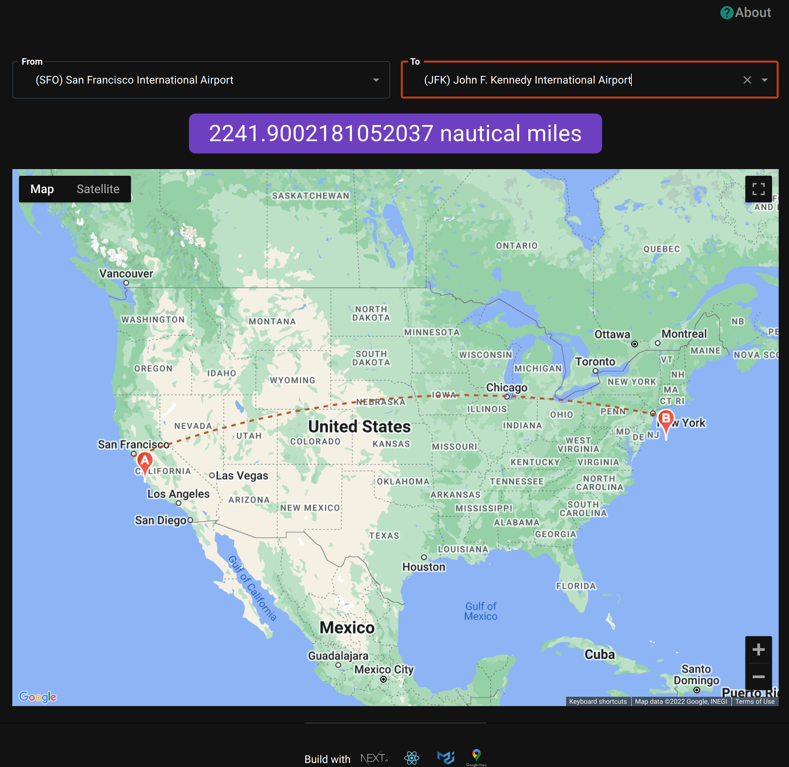

## About

This App is used to calculate the distance (in Nautical Miles) between any two Airports in United State. The airports can be searched either via Name or their 3-letter IATA code. The search will be visually shown on the Google Map plugin. The flight trajectory will be drawn via simple polyline.

This App is build with Next.js, React, MUI v5, Redux, Google Map API, AirLabs API.

## Built With

- [React](https://react.com)
- [Next.js](https://nextjs.org/)
- [AirLabs Airport Database API](https://airlabs.co/docs/airports)
- [MUI v5](https://mui.com/)
- [React Google Maps API](https://react-google-maps-api-docs.netlify.app/)
- [Redux](https://redux.js.org/)
- [TypeScript](https://www.typescriptlang.org/)

## Netlify

The application is deployed on Netlify at:
https://63694a57dd331113ff60ed9b--magenta-lily-18fbbb.netlify.app/

## Screenshots



## Getting Started

This is a [Next.js](https://nextjs.org/) project bootstrapped with [`create-next-app`](https://github.com/vercel/next.js/tree/canary/packages/create-next-app).

First, run the development server:

```bash
npm run dev
# or
yarn dev
```

Open [http://localhost:3000](http://localhost:3000) with your browser to see the result.

You can start editing the page by modifying `pages/index.tsx`. The page auto-updates as you edit the file.

[API routes](https://nextjs.org/docs/api-routes/introduction) can be accessed on [http://localhost:3000/api/hello](http://localhost:3000/api/hello). This endpoint can be edited in `pages/api/hello.ts`.

The `pages/api` directory is mapped to `/api/*`. Files in this directory are treated as [API routes](https://nextjs.org/docs/api-routes/introduction) instead of React pages.
